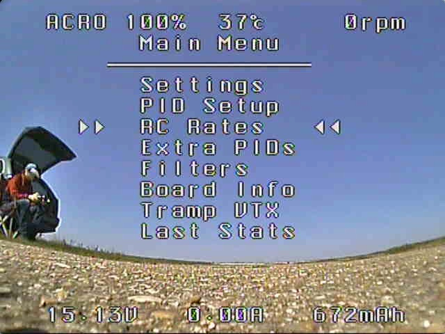
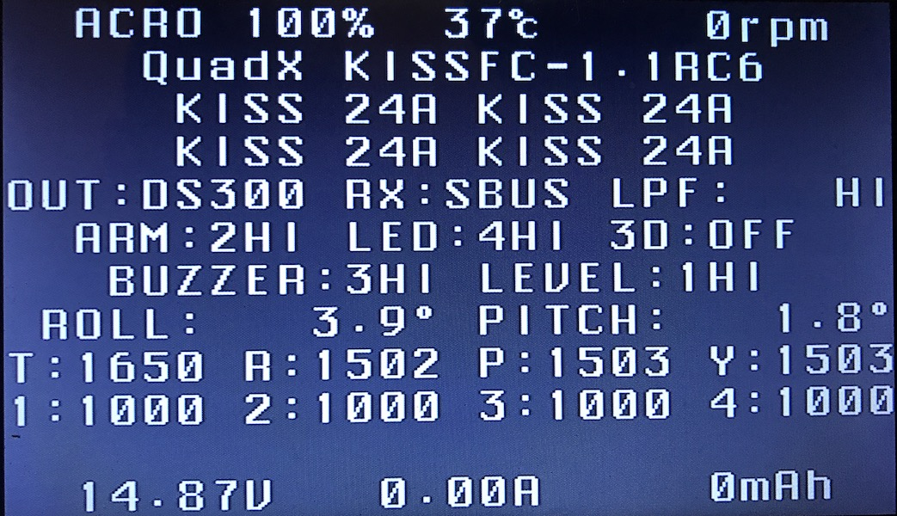
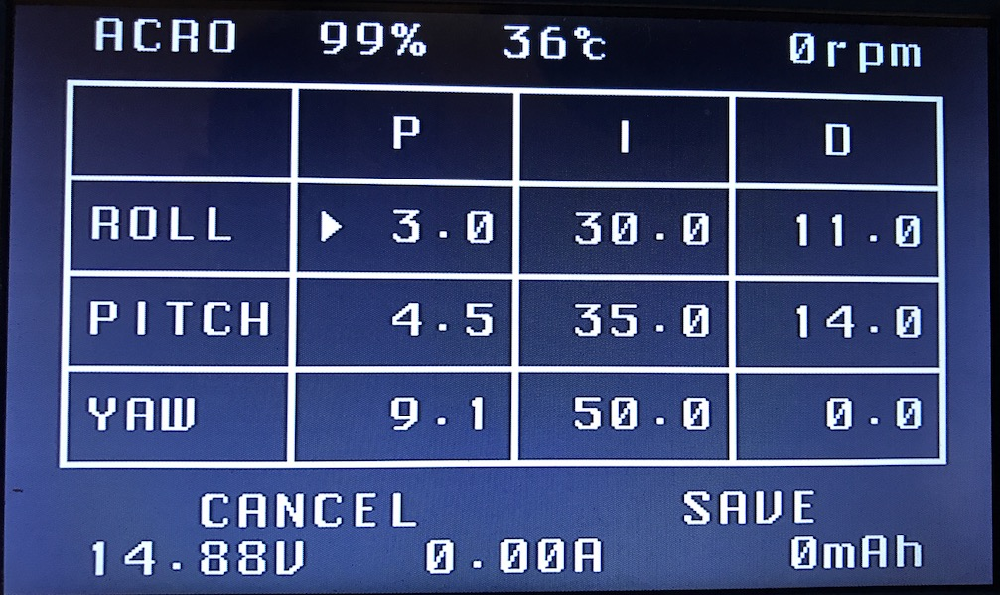
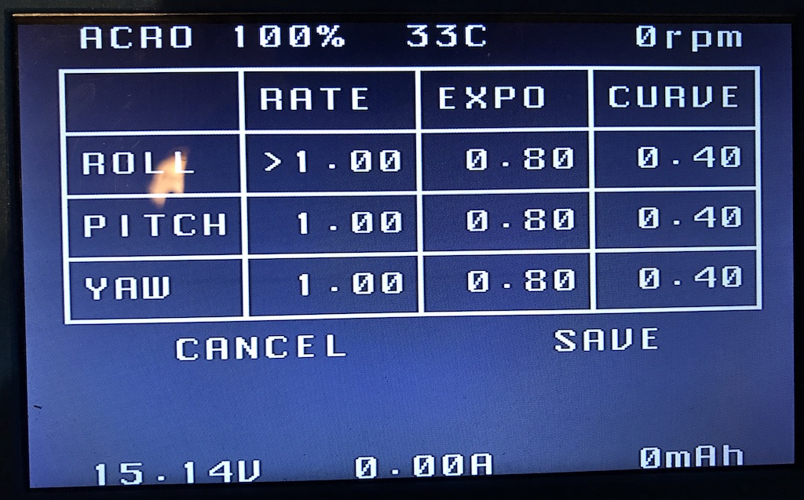

# KissKONG - Next Generation KISS OSD

This is a written-from-scratch code to communicate with KISS FC and control MAX7456 to disaply OSD GUI

Both ```KissAndMsp``` and ```MAX7456``` are stand-alone libs that can be used in other projects.

To be able to use the menu to change settings, ARM MUST be set to be controlled by a switch!
If setting is not detetcted, only live data and flight statistics will be shown.

### Controls (Throttle always in center)
* Enter Main Menu -> Yaw Right + Roll Left
* Move Left /Right -> Roll (also Enter/Exit in Menu/Info)
* Move Up/Down ->  Pitch
* Enter/Exit(Add/Substract) -> Yaw

### Menu can be entered ONLY when disarmed

### Example Screens










